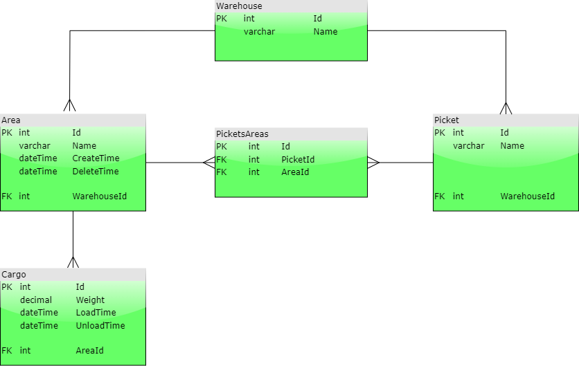

# SoftMastersTest

Тестовое задание при приеме на работу

Должность: инженер-программист.  
Цель тестового задания: подтверждение квалификации кандидата, в том числе на удаленную работу.   
Средства реализации: 
• язык программирования: С#;  
• инструменты реализации: 
◦ .Net 8 WebApi + Blazor (UI компоненты по-вкусу, предпочтительно Radzen);
◦ СУБД (на выбор кандидата):
▪ SQLite;
▪ MS SQL Server Experss (не ниже версии 2016);
▪ PostgresSQL  (не ниже версии 15, предпочтительный вариант).

Описание предметной области:
В качестве объекта предметной области возьмем Угольный склад в морском торговом порту (см. Схему склада 1). 

Схема склада 1:
Склад 1	Склад
101	102	103	104	105	Пикеты
101-104	105	Площадки
53000,000	5000,000	Грузы (т)

«Склад» состоит из мельчайших частей с одинаковой площадью – «пикетов», они считаются неизменяемыми. Склад 1 состоит из пикетов: 101,102,103,104,105 (см. Схема склада 1);
Соседние Пикеты, временно, могут объединяться в «Площадки». Например, площадка 101-104 состоит из пикетов: 101,102,103,104 (см. Схема склада 1). Площадки не могут пересекаться и разрываться. Площадка может состоять из одного пикета;

Задание:
· Привести таблицу к 3-й нормальной форме (в соответствии с условиями, описанными ниже);
Номер склада	Номер площадки	Номер пикета	Груз на площадке(т)
Склад 1	101-104	101	53000,000
Склад 1	101-104	102	53000,000
Склад 1	101-104	103	53000,000
Склад 1	101-104	104	53000,000
Склад 1	105	105	5000,000
Склад 2	201-202	201	8000,000
Склад 2	201-202	202	8000,000
Склад 2	203-205	203	15000,000
Склад 2	203-205	204	15000,000
Склад 2	203-205	205	15000,000

 
При выполнении задания, необходимо учитывать следующие условия:
· Обязательно хранить историю изменения площадок. Т.е. всегда можно определить на какие площадки был разбит склад в то или иное указанное время;
· Обязательно хранить историю изменения грузов на площадках. Т.е. на определенную дату и время, можно определить на какие площадки был разбит склад, и сколько груза находилось на этих площадках.
· Вывести список Площадок на указанную дату с фильтром по грузу.
· Реализовать «Редактор площадок». Необходимо выполнить следующие условия:
a. Реализовать операции CRUD для площадок и смежных с ними объектов;
b. обработку данных выполнить с помощью ORM(на выбор: Entity Framework Core, Dapper+SqlKata, NHibernate, eXpress Persistent Objects (XPO));
c. Установить необходимые ограничения пользовательского интерфейса (длины полей, блокировки кнопок и т.д.);
d. Обработать ошибки (исключения), с выводом на естественном языке в пользовательском интерфейсе;
e. Подробно закомментировать реализуемый текст кода(классы, методы, свойства).

Примечание: 
 - Неописанные явным образом условия остаются на усмотрение разработчика.

Демонстрация:
Выполненную работу необходимо продемонстрировать в электронном виде(исходный код проекта, можно выложить на gitflic или github). 
Результатом выполнения задания является:
• функционирующее приложение, соответствующее пункту «Задание» и всем его подпунктам;
• пояснительная записка с кратким обоснованием выбранного инструментария и подхода к разработке. В тексте должны быть представлены ответы на следующие вопросы:
▪ Почему выбрана та или иная технология, в чем разница в рамках Вашей реализации?
▪ Какой технологический стек был отклонен на этапе планирования?
▪ Как пришли к конкретно такой реализации?
▪ Почему выбрана такая структура проекта?

В определенных случаях тестовое задания может рассматриваться как предмет для обсуждения на собеседовании, либо возвращено на доработку:
• кандидат не разобрался с предметной областью;
• выполнено менее 90% подпунктов пункта «Задание»;
• имеют неточности относительно предметной области.

